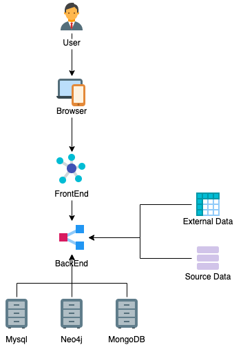
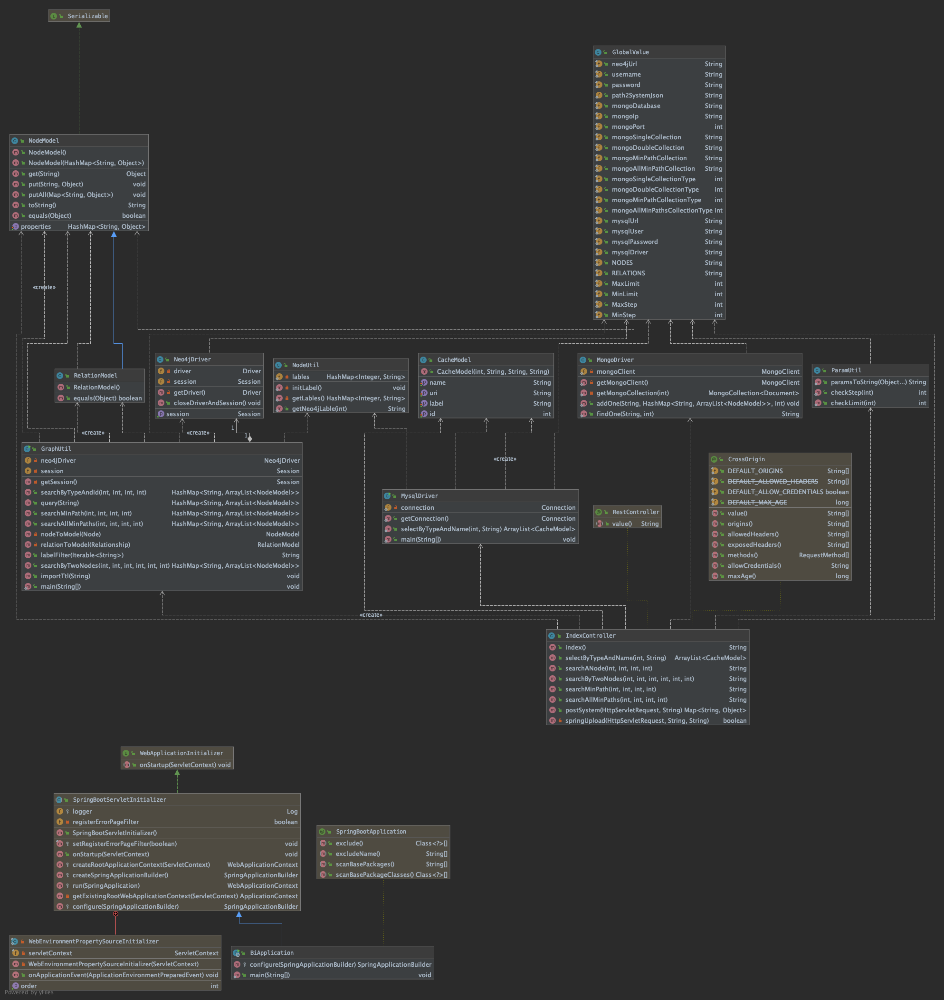
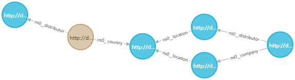
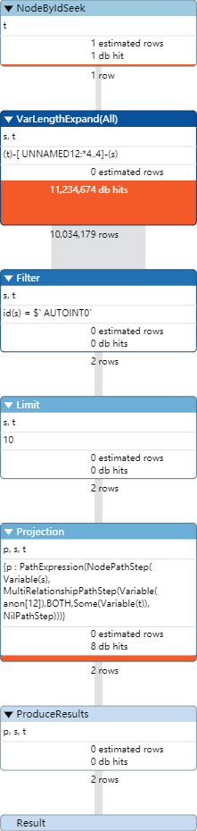
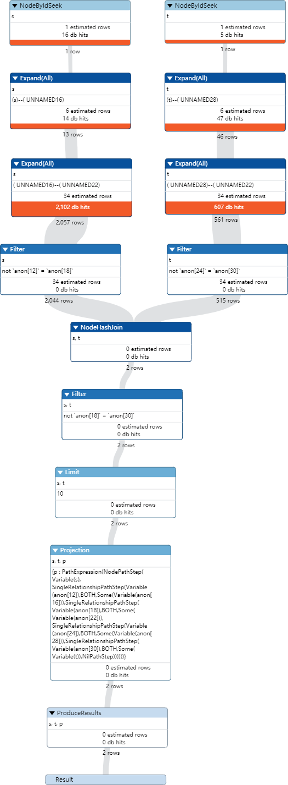
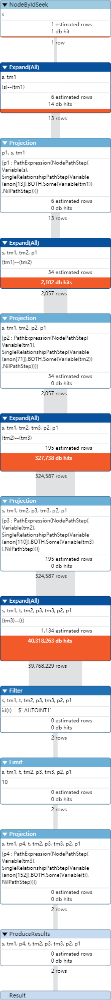
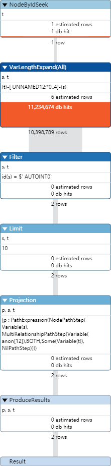
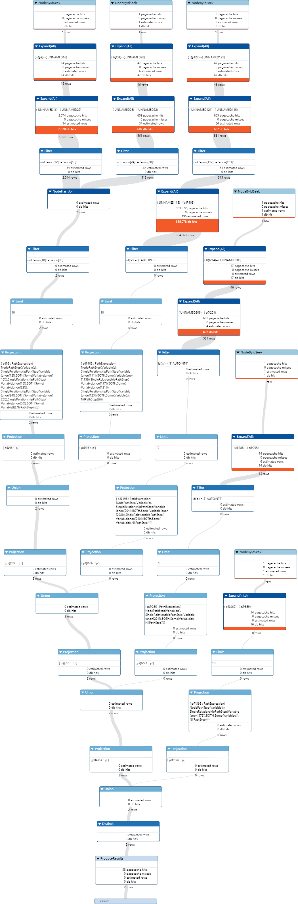

# 商务智能课程项目

>第九组

[TOC]

## 项目简介

在本项目中，利用来源于维基百科（Wikipedia）的结构化数据抽取（DBPedia），实现了一个端到端的智能分析系统，实现的功能包括数据采集、数据转换、数据存储、数据分析和可视化等。

### 项目架构

- 前端：vue+d3.js
- 后端：springboot+python
- 数据库：Neo4j、MongoDB、MySQL



### 类图



## ETL

### neo4j数据导入

对于数据本身而言，DBpedia主要采用基 于语义 Web的知识组织模式。DBpedia采用 RDF语法表示和组织知识，DBpedia中 采 用 不 同 的 属 性 表 示 资 源 的 不 同 信 息 ，如下表所示：

| 属性                               | 含义                     |
| ---------------------------------- | ------------------------ |
| http://dbpedia.org/resource/       | 资源的名称信息           |
| http://dbpedia.org/ontology/       | 对应 Wikipedia信息框属性 |
| http://xmlns.com/foaf/0.1/         | 指向对应的foaf属性       |
| http://xmlns.com/foaf/0.1/homepage | 资源的主要地址           |

我们采用```neosemantics```插件作为neo4j数据导入的工具，保证数据信息最大程度的完整性。

```neosemantics```是一个插件，可以**在Neo4j中使用RDF**。n10的一些主要功能包括：

- **将RDF数据以**无损方式**存储在Neo4j**中（随后可以导出导入的RDF，而不会丢失该过程中的任何一个三元组）。
- Neo4j 的按需**导出属性图数据**作为RDF。
- 基于**W3C SHACL语言的**模型**验证**

对于我们感兴趣的数据，添加标签以加速查询。

1. 电影数据

添加```Movie```标签，我们发现大部分的电影都会拥有``director``这个关系，即可以通过

```cypher
MATCH p=(a)-[r:ns0__director]->() RETURN distinct(a)
```

这样的方式加入，但是有一些实体拥有```type```属性，则不是电影，因此我们通过删除这些数据的```Movie``` 标签得到电影。

最终的数量为：35146

具有的主要关系：starring cinematography distributor editing musicComposer writer director producer

2. 歌曲数据

添加```Music```标签，我们发现大部分的歌曲都会拥有``musicalArtist``这个关系，即可以通过

```cypher
MATCH p=(a)-[r:ns0__musicalArtist]->() RETURN distinct(a)
```

最终的数量为：17892

具有的主要关系：subsequentWork previousWork
genre album musicalArtist format writer musicalBand recordLabel producer

3. 图书数据

添加```Book```标签，我们发现大部分的图书都会拥有``author``这个关系，即可以通过

```cypher
MATCH p=(a)-[r:ns0__author]->() RETURN distinct(a)
```

这样的方式加入，但是有一些实体拥有``developer``属性，是程序，则不是书籍，以及部分电影数据也拥有```author```属性，因此我们通过删除这些数据的```Book``` 标签得到电影。

最终的数量为：23407

具有的主要关系：language author publisher country previousWork subseqentWork nonfictionSubject genre literaryGenre 

其中他的类型比较杂乱，拥有nonfictionSubject genre literaryGenre等表述，我们也做了相应的统一。

### mysql数据导入

mysql数据来源于neo4j中的实体数据，对于neo4j中的实体数据，都拥有```Resourse```这一标签。为了导入mysql，我们主要做了以下工作：

1. 将实体uri使用‘/’切分字符串，找到实体名称
2. 筛选数据标签，将不是```Resource```的标签提取出来

将以上数据导出成CSV格式，使用Data Import工具导入mysql数据库中。

## Storage System

本项目主要使用了Neo4j、Mysql、MongoDB三种数据库，其中neo4j主要存储实体节点及其关系，实体间关系的查询；mysql主要存储实体节点信息，用于实体名字的模糊查询；mongodb主要存储查询的结果，用于缓存查询结果。

### neo4j

Neo4j是⼀种基于图的数据库，以图的形式存储数据，⽽这种数据格式的结构特殊性使得其在复杂繁琐的关系处理上很⾼效。我们使⽤Neo4j为本项⽬构建了知识图谱模型，并在此基础上提供⼀些检索服务。

版本：4.0.4

节点数：2,369,342

关系数：6,874,999

关系类型数：651

存储结构：

1. 关系

| 类型                               | 含义                     |
| ---------------------------------- | ------------------------ |
| source       | 关系源节点           |
| relation       | 关系名称 |
| target         | 关系目标节点       |

2. 实体

| 类型                               | 含义                     |
| ---------------------------------- | ------------------------ |
| id       | 实体唯一标识id          |
| label       | 实体标签 |
| uri         | 实体rdf表示       |

存储优化：

1. 针对本项目感兴趣的实体属性加标签，搜索时指定标签，加速搜索；

2. 本项目搜索主要是通过id进行搜索，所以在id上建立索引，加速搜索。

```cypher
create index on :Resource(id)
```


### mysql

mysql主要存储实体节点信息，用于实体名字的模糊查询，⽬的是提⾼用户查询的响应速度。

在⽤户界⾯中，我们通过搜索实体名称，根据实体的名称确定需要查询的实体，并由⽤户选择特定的实体从⽽根据其返回对应的实体及其关系的结果集。

虽然neo4j在处理关系上很⾼效，但是在独⽴实体上的名称查询就会很慢，因此我们使⽤关系型数据库mySQL存储所有节点的名称、id、类型标签及其uri。

版本：8.0

数据量：2,369,339

存储结构：

其中只涉及一张叫node的表，结构如下

| 字段                               | 含义                     |
| ---------------------------------- | ------------------------ |
| id       | 实体唯一标识id          |
| label       | 实体标签 |
| name         | 实体名字       |
| uri         | 实体rdf表示       |

存储优化：

1. 建立关于主键id的索引，加速搜索；

2. 建立关于name的全文索引，加速名字匹配。

```sql
CREATE FULLTEXT INDEX ft_name ON node (name)
```

在使用时，语句需要改为：

```sql
SELECT * FROM node WHERE MATCH (name) AGAINST ('David') LIMIT 50
```

处理数据得到的本体层文件存入ontology表中，表的结构如下所示：

| 字段   | 含义           |
| ------ | -------------- |
| typeId | 实体唯一标识id |
| label  | 本体名称       |
| name   | 实体名字       |

外源性数据如果符合表的结构，则存入名为```external```的```schemas```中。如额外电影数据存入表名为：```ex_movies```。

### mongoDB

mongodb主要存储查询的结果，用于缓存查询结果，提⾼查询的响应速度。我们将特定检索关键词的字符串连接结果作为key，并创建⼀个包含检索时间和检索结果的value，以此构建key-value对存储mongoDB中。在下⼀次query动作产⽣时，会先检索mongoDB中是否包含该历史记录，并将其返回，若不包含则创建⼀个key-value对存⼊MongoDB中。

版本：4.2

存储结构：

其中存储的collection（相当于mysql中表的概念）如下表所示，

| collection名称                               | 含义                     |
| ---------------------------------- | ------------------------ |
| single       | 单节点查询          |
| double       | 两节点查询 |
| minpath         | 两节点最短路径查询       |
| allminpaths         | 两节点全部最短路径       |

每个collection中存储的文档格式（相当于mysql中一行数据）均相同，如下表所示

| key                               | 含义                     | 数据类型 |
| ---------------------------------- | ------------------------ |------------|
| id       | 查询key值          |String |
| time       | 查询时间 | Datetime |
| result         | 查询结果       | JSON String|


存储优化：

1. 为了保证mongoDB中存储数据的总量的大小及缓存的及时更新，为mongoDB设置自动删除过期缓存；

```sql
db.col.createIndex( { "time": 1 }, { expireAfterSeconds: 60*60*24*2 } )
```

2. 为了加速mongoDB中id的搜索速度，为id添加索引

```sql
db.col.createIndex({"id":1})
```

外源性数据如果符合```JSON```的结构，则存入名为```external```的```database```中，collection名为：```data```。

## BI Server

本项目主要实现了四种原始数据的基本检索功能，其中针对两节点多跳关系的查询进行了查询方式的比较及优化；***同时实现了XXX（智能分析请补充）！！！***

### 原始数据检索

针对四种原始数据检索，介绍分别如下。

#### 单节点查询

查询要求：输⼊一个实体（如Alibaba），查询其关联的所有关系和关联实体。

```sql
MATCH p=((n:label)-[*step]-()) where id(n)=id return p limit limitnum
```

其中，label为查询节点的类型标签，id为节点id，limitnum为限制返回实体的条数。

#### 两节点查询

查询要求：输⼊两个实体（如Alibaba和Tencent），查询其可能存在的多跳关系。其中多跳关系定义为，通过多条边链式的连接在一起。如Alibaba -> (Industry) Internet -> Tencent。

对于多跳节点的查询，主要有三种方式，我们针对这三种方式以查询4跳关系为例，进行查询效率的比较以及成因分析。

查询场景：查询id为1683654和id为590的两个实体的四跳关系，限制返回结果数为10。

查询结果如下图所示：



##### 方式1：深度运算符 *

对于第一种方式，我们可以直接采用neo4j提供的深度运算符 * 进行查询。

```cypher
match p=(s)-[*4]-(t) where id(s) = 1683654 and id(t) = 590 return p limit 10
```

耗时:2973 ms

使用profile查看执行计划，结果如下图所示：



我们可以看到对于此种方式，neo4j首先执行```VarLengthExpand(All)```查询出了关于节点s=1683654的全部的4跳关系，之后在执行```Filter```从全部关系中筛选出指向节点为t=590的关系。这其中大量的时间耗费在了深度遍历查询全部4跳关系以及筛选中。

##### 方式2：直接拼接节点查询

对于第二种方式，则更加粗暴一点，直接将二者关系表示为四跳的形式。

```cypher
match p=(s)-[]-()-[]-()-[]-()-[]-(t) where id(s) = 1683654 and id(t) = 590 return p limit 10
```

耗时：16 ms

使用profile查看执行计划，结果如下图所示：



我们可以看到对于此种方式，neo4j首先并行多次执行```Expand(All)```分别查询出了关于节点s=1683654的全部的2跳关系和关于节点t=590的全部的2跳关系，之后在执行```NodeHashJoin```做节点的HashJoin，将相同的节点匹配，得到二者的4跳关系。这样操作效率极高，查询速度快。

##### 方式3：with字句

对于此种查询，我们还可以使用with子句，逐步每一跳的结果，之后利用上一步的查询结果进行下一步查询，最终拼接成多跳关系。

```cypher
match p1=(s)-[]-(tm1) where id(s) = 1683654 with p1,tm1 match p2=(tm1)-[]-(tm2) with p1,p2,tm2 match p3=(tm2)-[]-(tm3) with p1,p2,p3,tm3 match p4=(tm3)-[]-(t) where id(t) = 590 return p1,p2,p3,p4 limit 10
```

耗时：6828 ms

使用profile查看执行计划，结果如下图所示：



我们可以看到对于此种方式，neo4j逐步每一跳的结果，之后利用上一步的查询结果进行下一步查询，最终通过筛选，返回多跳关系。这样耗时更为严重，效率更加低下。

对于n跳以内的查询，我们主要比较了使用深度运算符[*0..4]和使用union拼接直接拼接查询这两种方式，结果如下所示。

##### 方式1：深度运算符[*0..4]

```cypher
match p=(s)-[*0..4]-(t) where id(s) = 1683654 and id(t) = 590 return p limit 10
```

耗时：3276 ms

使用profile查看执行计划，结果如下图所示：



执行步骤和主要耗时同之前。

##### 方式2：使用union拼接直接拼接查询

```cypher
match p=(s)-[]-()-[]-()-[]-()-[]-(t) where id(s) = 1683654 and id(t) = 590 return p limit 10 
union 
match p=(s)-[]-()-[]-()-[]-(t) where id(s) = 1683654 and id(t) = 590 return p limit 10 
union 
match p=(s)-[]-()-[]-(t) where id(s) = 1683654 and id(t) = 590 return p limit 10 
union 
match p=(s)-[]-(t) where id(s) = 1683654 and id(t) = 590 return p limit 10 
union 
match p=(s)-[]-(s) where id(s) = 1683654 return p limit 10
```

耗时：642 ms

使用profile查看执行计划，结果如下图所示：



我们可以看到对于此种方式，neo4j将多个union子句分为多个并行任务进行执行，而对于其中的多跳查询也利用上述之前提到的方式进行执行，执行速度较快。

因此我们最终决定**使用union拼接直接拼接查询**的方式进行两个实体间多条关系的查询。

#### 两节点最短路径查询

最短路径我们采⽤了Neo4j内置的shortestPath函数进⾏查找，其使⽤快速双向⼴度优先搜索算法，为避免出现暴⼒穷举的情况，我们在配置中设置了```cypher.forbid_exhaustive_shortestpath=true```。语句如下：

```cypher
MATCH (source:sourceType),(target:targetType) WHERE id(source) = sourceId AND id(target) = targetId MATCH p = shortestPath((source)-[*]-(target)) return p
```

其中，sourceType和targetType分别为两个查询节点的类型标签，sourceId和targetId分别为两个查询节点的id。

#### 两节点全部最短路径

最短路径我们采⽤了Neo4j内置的allShortestPaths函数进⾏查找。

```cypher
MATCH (source:sourceType),(target:targetType) WHERE id(source) = sourceId AND id(target) = targetId MATCH p = allShortestPaths((source)-[*]-(target)) return p
```

其中，sourceType和targetType分别为两个查询节点的类型标签，sourceId和targetId分别为两个查询节点的id。

### 可视化实现

#### 力导向图

采用了d3.js提供的力导向图框架实现，将后端返回的数据定义为node和link并在矢量图中设置相应的属性，其中顶点的定义如下：

```javascript
var node = svg.append("g").attr("class", "nodes").selectAll("circle").data(graph.nodes)
        .enter().append("circle").attr(
            "id",
            function (d) {
                return d.id
            }
        ).attr("r", function (d) {
            if (d.id == searchOneVue.id || d.id == searchTwoVue.id1 || d.id == searchTwoVue.id2 || d.id == relatedId) return 20;
            else return 10;
        }).attr("fill", function (d) {
            return type2color[d.label];
        }).attr("stroke", "none").attr("name", function (d) {
            return d.name;
        }).call(d3.drag()
            .on("start", dragstarted)
            .on("drag", dragged)
            .on("end", dragended)
        );

    node.append("title").text(function (d) {
        return d.name;
    });
```

它所包含的属性如下：

| 属性名 | 值             | 作用                       |
| ------ | -------------- | -------------------------- |
| r      | 取决于聚焦程度 | 对正在查询的点进行放大显示 |
| fill   | 取决于类别     | 根据返回的属性进行渲染     |
| title  | 顶点名称       | 鼠标长时间hover上浮显示    |

初次之外，还定义了三个函数```dragstarted()```、```dragged()```和```dragendend()```，分别代表拖动开始、拖动中和拖动结束的时间处理，方便用户进行查看。

边和边上的text定义如下：

```javascript
var link = svg.append("g").attr("class", "links").selectAll("line").data(graph.links)
        .enter().append("line").attr(
            'name',
            function (d) {
                return d.label;
            }
        ).attr("stroke-width", function (d) {
            //return Math.sqrt(d.value);
            return 1; //所有线宽度均为1
        }).attr(
            'id',
            function(d){
                return d.id;
            }
        ).style("stroke", function (d) {
            return 'grey';
        });
 var linkText = svg.append('g').selectAll("line")
        .data(graph.links)
        .enter()
        .append("text")
        .attr("font-family", "Arial, Helvetica, sans-serif")
        .attr("x", function (d) {
            if (d.target.x > d.source.x) {
                return (d.source.x + (d.target.x - d.source.x) / 2);
            } else {
                return (d.target.x + (d.source.x - d.target.x) / 2);
            }
        })
        .attr("y", function (d) {
            if (d.target.y > d.source.y) {
                return (d.source.y + (d.target.y - d.source.y) / 2);
            } else {
                return (d.target.y + (d.source.y - d.target.y) / 2);
            }
        })
        .attr("fill", "white")
        .style("font", "normal 12px Arial")
        .attr("dy", ".35em")
        .text(function (d) {
            return d.label;
        });
```

其中线的定义比较简单，只设置了默认的长度和颜色，线上对应的说明文字则需要手动添加。在创建过程中，首先选中所有的线，获取其的x属性和y属性，并根据方向关系算出描述文字的位置。

之后，还需要在ticked中将他们的位置实时更新，代码同上。

当鼠标进入某个node后需要将它的数据实时更新到右侧的面板中，故利用mouseenter事件配合类选择器对整个svg进行监听，只有当用户没有产生拖动动作时，该部分才会被更新，同时，一些d3生成属性应该被忽略：

```javascript
if (!dragging) {

        var name = $(this).attr('name');
        var id = $(this).attr('id');
        var sel_node;

        $('#info h4').css('color', $(this).attr('fill')).text(name);
        $('#info p').remove();

        for (var i = 0; i < graph.nodes.length; i++) {
            var node = graph.nodes[i];
            if (node['id'] == id) {
                sel_node = node;
                break;
            }
        }

        for (var key in sel_node) {

            if (key == 'x' || key == 'y' || key == 'vx' || key == 'vy' || key == 'index' || key == 'fx' || key == 'fy') continue;
            if (key == 'uri') {
                $('#info').append('<p><span>' + key + '</span>' + '<a href = \'' + sel_node[key] + '\'>' + sel_node[key] + '<a>' + '</p>');
                continue;
            }
            $('#info').append('<p><span>' + key + '</span>' + sel_node[key] + '</p>');
        }
    }
```

#### 信息检索

本次的查询界面分单节点和双节点，两者的逻辑类似，以单节点的代码为例。

弹出框和遮罩阴影采用了原生css动画实现，同时，由于表单部分涉及了较多数据交互和实时更新，故对两个弹出框分别引入了名为```searchOneVue```和```searchTwoVue```的vue变量进行数据绑定。

在进行模糊搜索时，对用户对搜索框的聚焦进行监听，当用户在聚焦搜索时，启动一个周期性函数向后端发送请求，同时更新```searchRes```数组对搜索结果进行动态更新：

```javascript
startFocus: function () {

            var p_this = this;
            this.sendInterv = setInterval(function () {

                var params = new URLSearchParams();
                params.append('type', p_this.type);
                params.append('name', p_this.curInput);

                if (p_this.curInput != '') {
                    axios
                        .post(requestURL + '/selectByTypeAndName', params)
                        .then(res => {
                            p_this.searchRes = res.data;
                        });
                }
                p_this.resShow = true;
            }, 4000);
        },

        stopFocus: function () {
            clearInterval(this.sendInterv);
        }
```

请求采用axios，当搜索框失焦(关闭窗口或选择了一个查询结果)时，清除这个周期变量。

当用户选中搜索框内容后，更新vue对象中的id和type，作为最终查询的数据准备，查询同样使用axios请求，在收到返回后，更新全局的graph.nodes变量和garph.links变量，并调用```initSvg()```对画布重新渲染：

```javascript
 axios.post(requestURL + '/searchANode', params)
                .then(res => {
                    console.log(res);
                    p_nodes = res.data.nodes;
                    p_relations = res.data.relations;

                    graph.nodes = [];
                    graph.links = [];

                    for (let i = 0; i < p_nodes.length; i++) {
                        var newNode = p_nodes[i]['properties'];
                        graph.nodes.push(newNode);
                    }

                    for (let i = 0; i < p_relations.length; i++) {
                        var newLink = p_relations[i]['properties'];
                        graph.links.push(newLink);
                    }
                    initSvg();
                    closeAll();
                })
```

### 基本智能分析

！！！！！！快去写，靴靴

## 系统优化及展望

！！！！都来补充，靴靴

### ETL

##### 如何⽀持更大规模的数据？

对于更大规模数据的支持，主要在于硬件和软件两个方面的改进。

- 硬件：升级磁盘，扩充存储容量，增加磁盘数量。

- 软件：对于当前的neo4j来说，neo4j企业版最多可以支持它有34.4亿个节点，344亿的关系，和6870亿条属性。可以尝试将数据进行拆分，分批次使用```neosemantics```进行导入，同时可以尝试多线程的方式进行导入，但由于数据库在更新之前都通过锁定节点和关系来保证线程安全，因此最终的瓶颈仍会出现在数据库上。

##### 如何更好地⽀持数据更新，⽽不是一次性导⼊入？

- 通过```cypher```以及```Java```实现对于图谱的动态增加、删除、修改。

- 通过构建知识图谱的模式层存储在Mysql数据库中，更好的定义类的层次结构、类的关系、类的领域以及类的属性，在数据更新时，根据本体规则进行注入，筛选错误的数据。

### Storage System

##### 如何更好地对图数据进⾏建模？

- 可以构建本体模式层，其主要来源于以下两部分：

    - 根据目前neo4j中已经存在的数据，自底向上构建，筛选同种实体，归纳共有属性、关系，如之前提到的movie、book、music等。

    - 根据dbpedia官方给出的[Ontology Classes](http://mappings.dbpedia.org/server/ontology/classes/)分类，自顶向下构建。

- 根据业务需求，决定是否需要构建本体层。知识图谱主要用来描述事物及事物之间的关系，这些事物可以是抽象概念也可以是概念的实例。因此，知识图谱本身就可以包含本体，即本体是知识图谱的一个子图。

    - 如果主要应用于一些专家系统，基于规则进行严谨的知识表示、查询和推理，需要本体定义支持。

    - 如果涉及的知识领域众多，知识复杂，主要想利用图在关系表示方面的优点表示事物之间联系，弱化复杂的推理功能，具有很高的容错性，以此达到更易被使用的效果，同时构建的知识图谱对数据一致性等要求不高，应用场景中对本体的依赖不大，不需要本体层也可以。

##### 如何提高查询性能？

- 建立索引

- 使用缓存

- 查询前预热

- 使用limit进行限制

- 对于可以实现相同功能的不同查询语句，比较不同查询语句的优劣

##### 如何增强系统的可扩展性，是否是分布式系统？

neo4j企业版只支持集群备份模式，不支持分布式，可扩展性较差。如果需要分布式系统，可以考虑将数据库迁移至JanusGraph或HugeGraph，这两个版本均支持分布式，以下为具体对比。

| 对比点     | neo4j    | JanusGraph |HugeGraph |
| ------------------------- | ------------------------ |------------|-------------- |
| 开源生态    |社区版开源，但较多限制，商业版闭源   |开源，兼容Apache Tinkerpop生态，主要由IBM提供云上服务 |开源，兼容Apache Tinkerpop生态，由百度领头，提供本土化技术与服务|
| 图查询语言       | Cypher | Gremlin |Gremlin|
| 支持数据规模        | 社区版十亿级      | 百亿级以上|千亿级以上|
|开放及可扩展性 | 无法扩展 | 可扩展，不过代码复杂导致难度较大，内置支持4种后端存储：HBase、Cassandra、Bigtable、Berkeley|可扩展，插件化机制扩展容易，内置支持6种以上后端存储：RocksDB、Cassandra、HBase、ScyllaDB、MySQL、PostgreSQL等|

### BI Server

##### 如何提⾼查询的性能？

- 建立索引

- 查询前预热

- 使用limit进行限制

- 对于可以实现相同功能的不同查询语句，比较不同查询语句的优劣

##### 是否可以采⽤缓存？

采用mongoDB作为查询缓存，如果想要进一步加速缓存效率，可以使用redis这类的key-value内存数据库加速查询效果。

##### 如何向通用的数据中台靠拢？

！！！！都来写！！！！

- 实现本体层统一存储：mysql中ontology中存储本体信息

- 实现ttl文件统一上传和存储的接口

  ```js
  /uploadSystemFile
  POST
  RequestParam: name, file
  注意：需要后端将文件存储在neo4j所在的物理机上
  ```

- 实现同种实体全部关系模式导出的Java脚本，函数名为```public static void exportRelation()```

- 实现同种实体全部关系导出为csv文件的Java脚本，函数名```public static void exportMovie()```

- 智能分析业务数据均由数据中台统一提供，包括neo4j导出服务和外部数据
- 外部数据根据数据特点存入mongoDB/Mysql统一管理


### 可视化

##### 沿图拓展

当用户点击一个点时，将该点放大并给出和该点相关的10条信息，选择逻辑同属性加载部分，更新画布的部分代码如下：

```javascript
p_nodes = res.data.nodes;
p_relations = res.data.relations;

new_nodes = [];
new_links = [];

for(let i =0;i < graph.nodes.length;i++){
  new_nodes.push({
    'name': graph.nodes[i].name,
    'id': graph.nodes[i].id,
    'label': graph.nodes[i].label,
    'uri': graph.nodes[i].uri
  }
                );
}

 for (let i = 0; i < p_nodes.length; i++) {

                var newNode = p_nodes[i]['properties'];
                /*判断存在*/
                var judge = false;
                for (let j = 0; j < new_nodes.length; j++) {
                    
                    if(newNode.id == new_nodes[j].id){
                        judge = true;
                        break;
                    }
                }

                if(!judge)new_nodes.push(newNode);
            }
/**下略**/
```

由于我们已经将节点数据同initSvg()进行了绑定，所以想法是直接更新数据，再通过调用重新渲染更新视图，在这一部分的实现中需要注意的问题有：

* 在节点扩展，即添加节点的过程中，应将原有节点同样保留，同时将选择的节点放大显示
* 保留原有节点涉及对原有节点数组的遍历查找，但经过d3的渲染封装，原有数据节点，尤其是```links```部分的source和target已经被添加了位置等额外信息，因此需要先将这些信息提取出来作为一个新的对象，再进行重复性检测